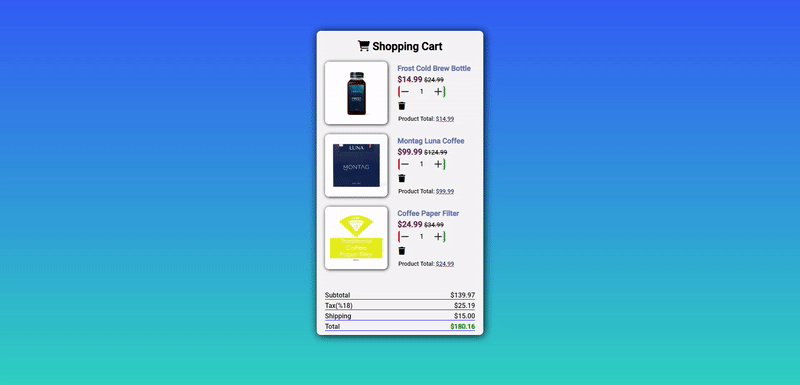

# shopping-cart

## Table of contents

- [Overview](#overview)
  - [The challenge](#the-challenge)
  - [User Stories](#user-stories)
  - [Project Skeleton](#project-skeleton)
  - [Screenshot](#screenshot)
  - [Links](#links)
- [My process](#my-process)
  - [Built with](#built-with)


## Overview

### The challenge

Project aims to create a real shopping cart page of e-commerce website. After the design, a payment page will be created and JS DOM and Events will dynamically calculate products .

### User Stories
   - When I click plus button on product's row, I can increase the product's quantity.
   - When I click minus button on product's row, I can decrease the product's quantity, but minimum quantity value can be 1.
   - When I click remove button on product's row, I can delete a product in the cart.
   - When I change any combination of product chart(plus, minus, remove etc.), I want to see the new calculation of chart's prices in concerned fields.

### Project Skeleton

```
css-challenge (folder)
        |----app.js
        |----index.html 
        |----style.css
        img (folder)
                |----cart-shopping-solid.svg
             
```
### Screenshot

<p align="center">
<a href="https://sezginakgul.github.io/shopping-cart/"></a>
</p>


### Links

- Live: [Live Website](https://sezginakgul.github.io/shopping-cart/)


### Built with

- Semantic HTML5 markup
- CSS custom properties
- Flexbox
- Mobile-first workflow
- Styled Components - For styles
- HTML Forms-Input Types
- HTML Form Elements
- CSS Colors-Border Properties
- CSS Margins-Padding
- CSS Properties for Texts-Font Families-Links
- CSS Overflow Property-The float Property-Opacity 
- Transparency-Units in CSS
- CSS Setting height and width-CSS Outline-CSS Combinators
- Javascript DOM
- Javascript Events
- Javascript Functions
- Comments


